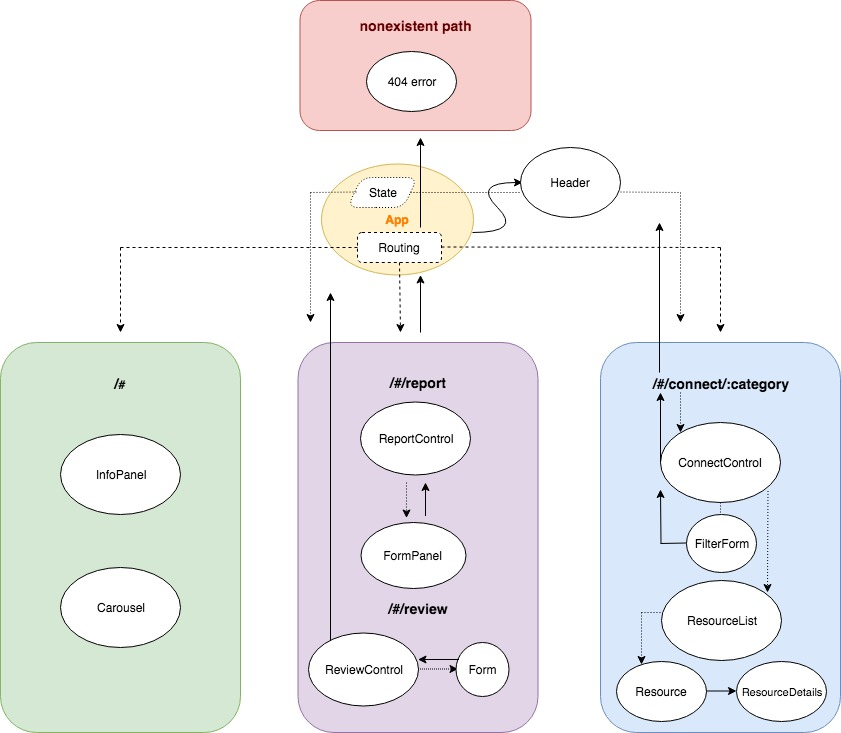

## PDX Hate Relief - React Clone
This is a basic React clone of **[PDX Hate Relief](https://github.com/Pabarreyro/pdx-hate-relief)**, an app made with Angular 6 that allows targets and witnesses of hate incidents to confidentially report them and get connected to local resources.

## Motivation
The initial motivation for **PDX Hate Relief** was to provide an outlet for vulnerable communities to report incidents of hate to trusted community-based organizations (CBOs). It is simultaneously a resource for CBO partners to share data and establish a unified message and strategy around combating hate in Portland. Cloning this app in React provides an opportunity to explore how the advantages of React might improve the app's performance and user experience.

## Component Tree

## Getting Started

* Clone this repository
* Run `npm install` to install all necessary dependencies
* Run `npm start` to start the development server

## Built With
* React
* JavaScript
* CSS
* Webpack

## Authors

* **Pablo** - *Principal work* - [Pabarreyro](https://github.com/Pabarreyro)

## Notes

### Migration issues

* Forms seem more complicated after cursory research. (_V0_)
* Integrating bootstrap downgraded to BS3. (_V0_)
* Difficult bargain between creating slightly distinct features, requiring unique components, and repetitive design approaches that may not suite all configurations of media/copy/etc. (_V0_)

### React v Angular

* React is much quicker at setting up an app with basic components (_V0_)
* Manipulating style is less familiar with React (_V0_)
* Embedding components seems like it will be easier with React (_V0_)

## License

This project is licensed under the MIT License - see the [LICENSE.md](LICENSE.md) file for details

## Acknowledgments

* Staff and fellow students for support and encouragement
* [Portland United Against Hate](https://www.portlandoregon.gov/oni/72583
), for the opportunity to apply my budding dev skills to as important an issues as this.
